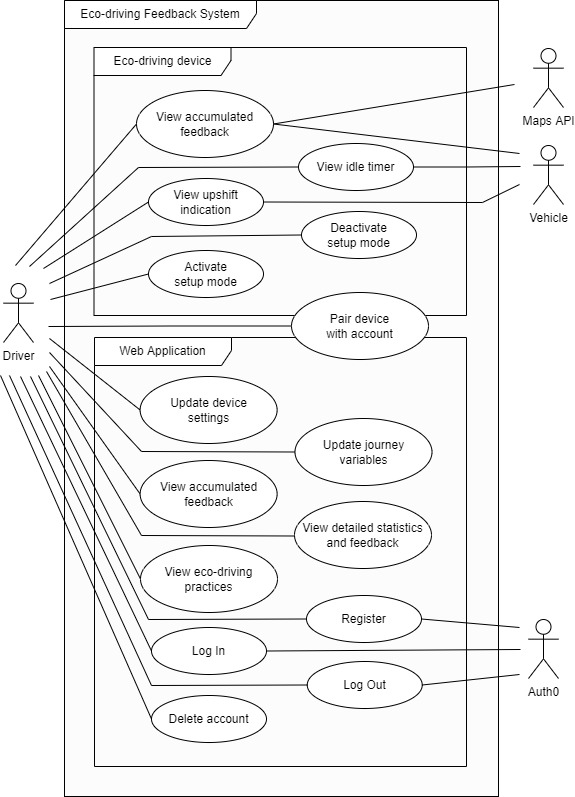

# Requirements

## User Requirements

### Must Have
1.  These requirements are non-negotiable and must be delivered by the
    project. They outline the minimum functionality needed to provide a
    minimum viable product (MVP) and satisfy the study's aims. These
    requirements are prioritised as such because they implement
    momentary, accumulated and offline feedback, allowing the EDD to
    function as intended, assisting drivers in improving their driving
    behaviour.

2.  The EDD shall act as a GSI whilst the user is driving, providing
    momentary feedback by indicating when most appropriate to up-shift
    for optimum fuel economy, taking into account external variables,
    most importantly road gradient. This will be the only form of
    momentary feedback in order to minimise the possible negative safety
    impacts of momentary feedback that have been discussed in .

3.  The EDD shall measure and log statistics on the user's driving
    behaviour regularly whilst they are driving. These statistics can be
    later used to calculate their driving performance. Eco-driving
    performance shall be calculated at run-time and not during logging
    to reduce storage requirements, reduce EDD processing requirements,
    allow deeper statistical analysis, and also allow new algorithms to
    be implemented on old data.

4.  The EDD shall calculate and display accumulated feedback to the user
    on their overall eco-driving performance. The feedback shall be
    aggregated for the last 30 days and displayed in the form of an
    interpretive schematic, such as green leaves or a plant growing,
    whilst they are driving. Their eco-driving performance shall be
    calculated based upon the criteria of:
    -   acceleration smoothness,
    -   deceleration smoothness,
    -   average upshift engine RPM,
    -   average engine RPM,
    -   speed limit adheration,
    -   average motorway speed,
    -   average engine idle duration,
    -   percentage of engine idle time from total driving time,
    -   and average journey length.

5.  A web application shall be created to accompany the EDD.

6.  The web application shall allow users to create and use their own
    individual accounts.

7.  The web application shall store the accumulated feedback data on the
    user's driving behaviour collected by the EDD.

8.  The web application shall allow the user to view the same
    accumulated feedback as available on the EDD.

9.  The web application shall present the user with statistics and
    recommended improvements for their eco-driving.

10. The web application shall not need the EDD to be running to access
    the user's feedback.

### Should Have
11. Important but not vital, these requirements add significant value
    but without them, the project is still viable. They allow the
    project to reach it's objectives more effectively, further improving
    the system's capabilities and quality.

12. The web application shall allow users to pair their account with an
    EDD.

13. The web application shall allow users to enter their vehicle's
    specifications, default journey variables and current journey
    variables for the EDD to use in it's calculations.

14. The EDD shall boot and begin running automatically when the driver
    starts their vehicle's engine.

15. The EDD shall gracefully shutdown, finishing processes and storing
    remaining driving data automatically when the driver turns off their
    vehicle's engine.

### Could Have
16. These requirements are desirable but are of minor importance and
    have a lesser impact if not completed.

17. The EDD shall present the user with a timer when they begin to idle,
    displaying how long they have been idling for to encourage them to
    switch the engine off during long idles.

18. The web application shall allow the user the view the eco-driving
    practices to learn how they can decrease emissions that cannot be
    directly measured by the EDD.

### Will Not Have
19. These requirements will not be implemented within the project's time
    frame and are considered to be outside of it's scope, but can be
    considered for future development.

20. The web application shall allow the user to modify the further
    variables listed below for each journey.
    -   Passenger count at points within a journey, providing the
        ability to account for passengers entering and leaving the
        vehicle during a journey in calculations.
    -   Journey purpose, to prevent short trips that cannot be replaced
        by alternative travel methods, such as shopping, being
        penalised.

21. The web application shall present the user with statistics comparing
    their eco-driving performance to the performance of other drivers.

22. The web application shall allow the user to share their eco-driving
    performance on social media platforms.

23. The web application shall allow users to customise the format and
    methods in which they are provided feedback.

## Use Cases

