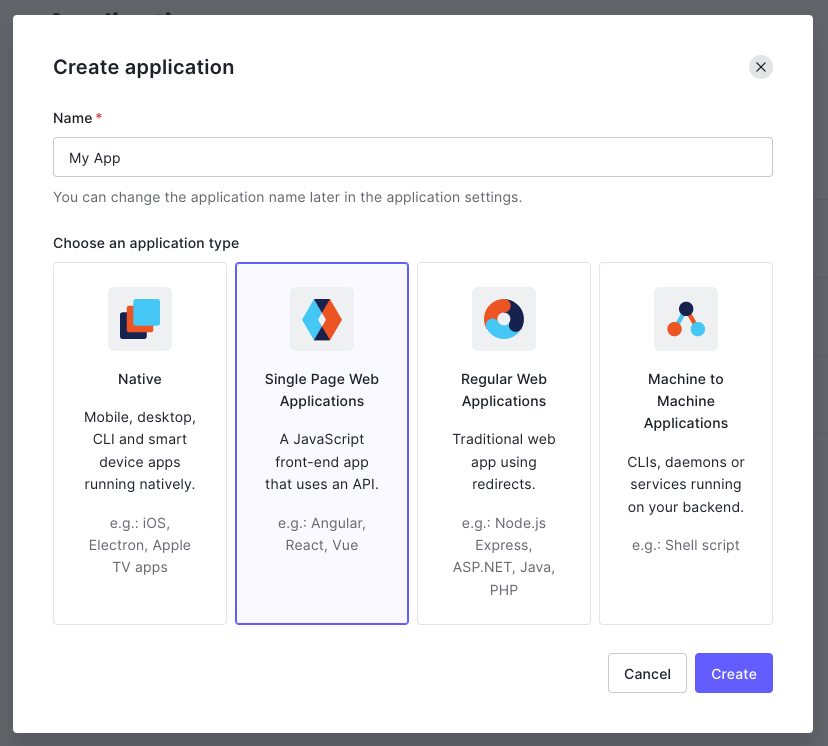
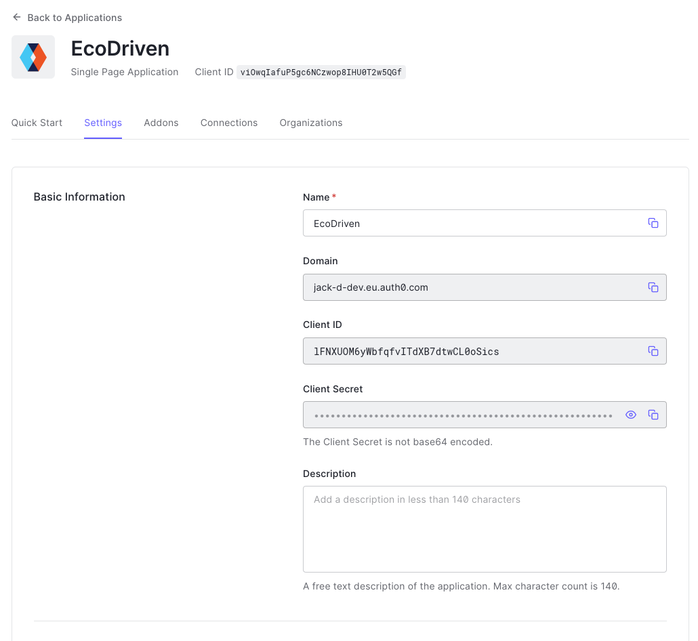
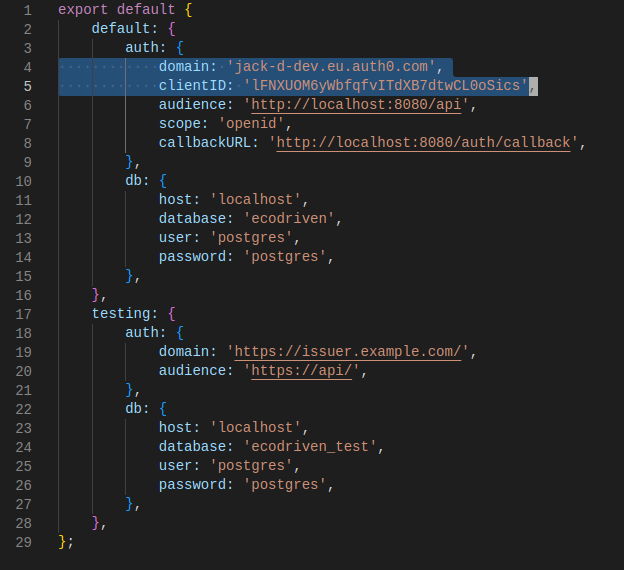
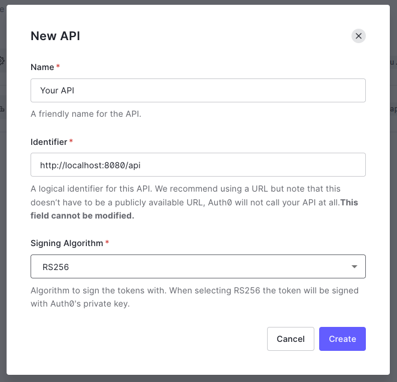
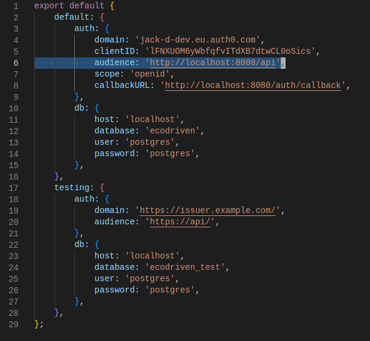

# Auth0 Setup

Setup instructions to use your own Auth0 tenant for the web application.

## Setting Up the Application

First, you'll need to create an application. This should have the application
type of `Single Page Web Applications`.

Once created, copy the application's Domain and Client ID to the auth object in
your `config.js` file.

Then, you'll need to setup the Application URIs with the following options:
- Allowed Callback URLs: `http://localhost:8080/auth/callback`
- Allowed Logout URLs: `http://localhost:8080/login, http://localhost:8080/auth/callback`
- Allowed Web Origins: `http://localhost:8080`

## Setting Up the API

After setting up the application, you'll also need to setup an API. Create an
API and set the Identifier to `http://localhost:8080/api`, you can see this used
as the audience in your `config.js` file.

## Ready To Go

Once you're application and API is set up and your `config.js` file is
configured correctly, you're all done and ready to go.
